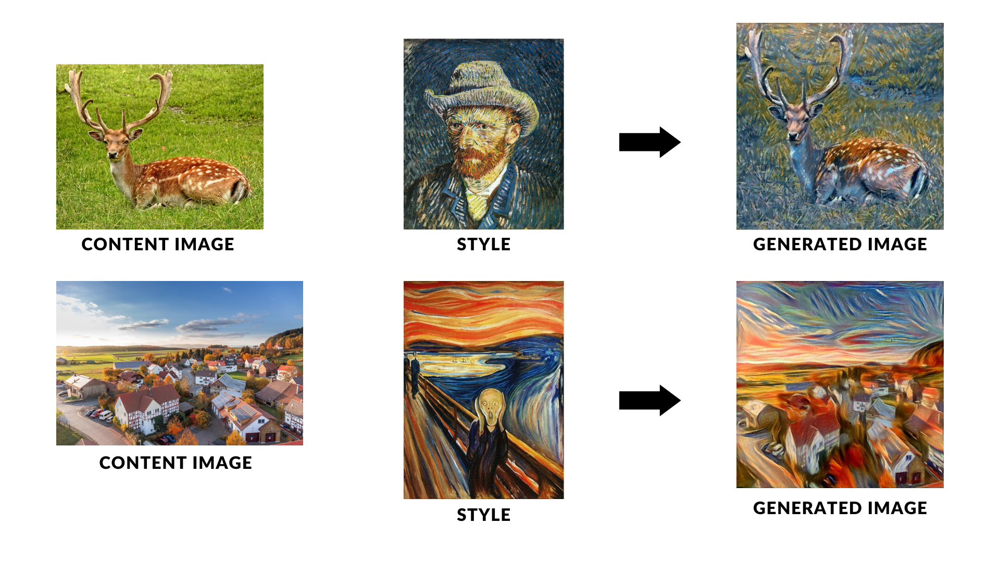

# Neural Style Transfer Project

## Overview
Neural Style Transfer is a fascinating application of Convolutional Neural Networks that blends two images, namely the content image and the style reference image, to generate a new image that mirrors the content of the former in the aesthetic of the latter. The underlying principle involves using a Gram matrix to capture style representations, which when combined with the content features, leads to a beautiful synthesis that's both recognizable and stylistically unique.

## Implementation Details
- **Framework & Libraries**: This project is implemented using PyTorch. 
- **Model Architecture**: We leverage the VGG19 model, known for its robust feature extraction capabilities.

- **Hyperparameters**:
    - Image size: 512x512
    - Epochs/Iterations: 6000
    - Learning Rate: 0.001
    - Content-Style Ratio: `alpha` = 1, `beta` = 0.01
    - Optimizer: Adam

- **Loss Composition**: The total loss is a weighted combination of content and style loss, defined as `total_loss = alpha * content_loss + beta * style_loss`.

## How to Use
To apply style transfer to your own images, edit the image paths in the notebook to point to your custom images. Once set, run all cells in the Jupyter notebook to perform the style transfer.

## Results
The results are visually stunning images that combine the structural essence of the content image with the textural elements of the style image. The output images will be available in the designated output directory.

For a detailed result display, custom images and their generated counterparts will be displayed here.

